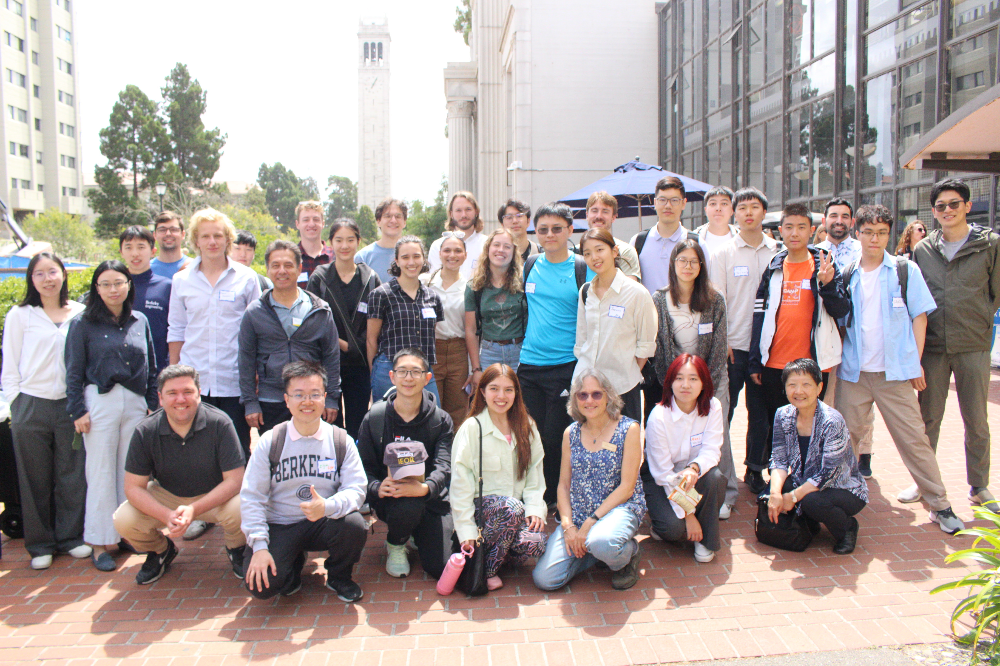
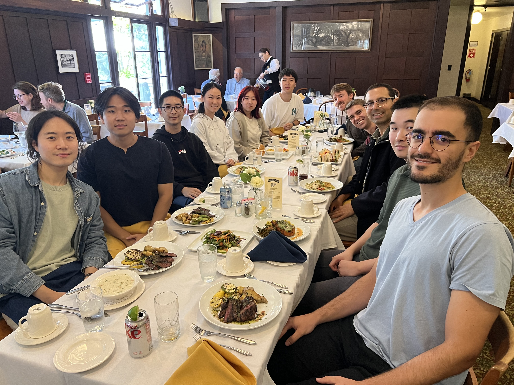

## Life in Berkeley
Well, this is my first month in Berkeley, everything seems so new to me, but this is the point of studying abroad, isn't it?
From now on, I will start working as a PhD student in UC Berkeley, and I am really looking forward to the following five years here. I enjoy the sunshine in California and our department as well. At the orientation session I got to meet all of our colleagues, and here is the picture of all of us (as well as part of the faculty members).

And at the first week we have our first group lunch this semester, I have to say I so lucky to join this group working with some many nice fellows. This is the picture of our group. 

    

The first year of Ph.D student will inevitably be pretty busy, since we got on average four courses to take per semester and I am supposed to take care of my research as well. But earning a Doctor's degree is a big challenge after all, so just face the challenge no matter what. Let's see what will happen in the following days.

